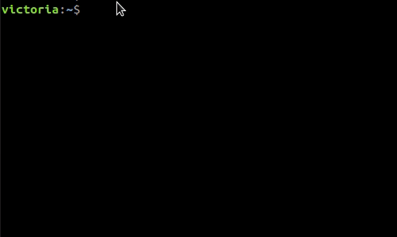

### Global setup

## brain-even
### Win game:

### Fail:

## brain-calc
### Win game:

### Fail:

## brain-gcd
### Win game:

### Fail:

## brain-progression
### Win game:

### Fail: 

## brain-prime
### Win game:

### Fail:

